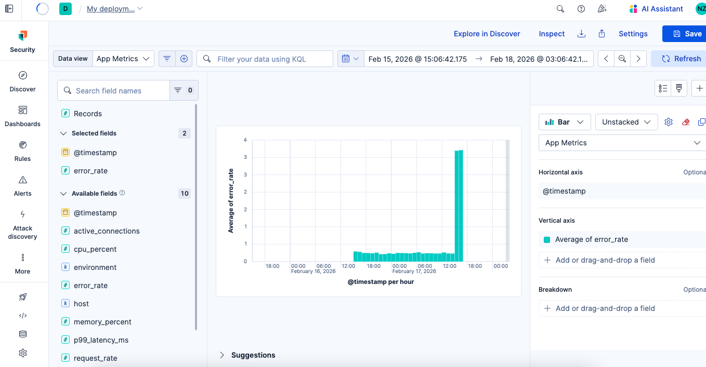

<p align="center">
  
</p>

<p align="center">
  <strong>Your autonomous AI SRE engineer. Apollo detects production anomalies, diagnoses root causes, executes rollbacks, creates Jira tickets, pages PagerDuty, generates postmortems, updates status pages, and alerts your team on Slack and Telegram -- all in 92 seconds, with zero human intervention.</strong>
</p>

<p align="center">
  Built for the <a href="https://elasticsearch.devpost.com/">Elasticsearch Agent Builder Hackathon</a> on Devpost.
</p>

---

## The Problem

Modern engineering teams drown in alerts. When something breaks at 3 AM:
1. PagerDuty fires. The on-call wakes up.
2. They spend 20-40 minutes digging through logs, metrics, and traces.
3. They cross-reference recent deployments and change logs.
4. They search for similar past incidents and find the runbook.
5. They write a summary, create a ticket, notify the team.

**Total time: 30-90 minutes of human toil per incident.**

Most of this work is pattern matching across data that already exists in Elasticsearch.

## The Solution

Apollo is a multi-tool AI agent that completes the entire incident response lifecycle autonomously in **under 2 minutes**:

| Step | What Apollo Does | Tool Type |
|------|-----------------|-----------|
| 1. Detect | Scans metrics for error rate spikes, latency regressions, connection pool saturation | ES\|QL |
| 2. Analyze | Examines error logs for specific failure patterns (NPE, timeouts, circuit breakers) | ES\|QL |
| 3. Correlate | Cross-references anomaly timing with recent deployments | ES\|QL |
| 4. Pattern Match | Searches historical incidents for similar root causes | Index Search |
| 5. Consult | Retrieves the relevant operational runbook | Index Search |
| 6. Validate | Verifies findings against real data -- pushes back on incorrect assumptions | ES\|QL |
| 7. Act | Creates incident record, sends Slack/Telegram alerts, recommends rollback | MCP + Workflow |

**Key differentiator**: Apollo doesn't just detect -- it investigates, diagnoses, and responds. The engineer wakes up to a solved problem, not a mystery.

### Apollo Detecting the Anomaly in Real-Time

<p align="center">
  
</p>

## Architecture

```
                          +-------------------------------+
                          |     Kibana Agent Builder       |
                          |     Agent: Apollo (10 tools)   |
                          +---------------+---------------+
                                          |
                +-------------------------+-------------------------+
                |                         |                         |
    +-----------+-----------+ +-----------+-----------+ +-----------+-------------+
    |  3x ES|QL Tools       | |  3x Index Search      | |  4x MCP Action Tools    |
    |  detect_anomalies     | |  search_past_incidents | |  send_telegram_alert    |
    |  analyze_error_logs   | |  search_recent_deploys | |  send_slack_notification|
    |  correlate_deploys    | |  search_runbooks       | |  create_incident_record |
    |  (Elasticsearch)      | |  (Elasticsearch)       | |  recommend_rollback     |
    +-----------------------+ +-----------------------+ +-----------+-------------+
                                                                    |
                                                        +-----------+-----------+
                                                        |           |           |
                                                   Telegram    Elasticsearch   Slack
                                                   Bot API    (incident docs)  Bot
                                                        |                      |
                                                  Two-Way Chat           @mention + DM
                                                  /investigate           Thread replies
                                                  /status
                                                  /resolve
                                                  /escalate

    +---------------------------+
    |  External MCP Clients     |
    |  VS Code / Claude Desktop |--------> mcp.doctusai.com/mcp (9 tools)
    |  Cursor / Any MCP Client  |
    +---------------------------+
```

## Multi-Channel Interface

Apollo lives where engineers already work:

| Channel | How It Works |
|---------|-------------|
| **Kibana Agent Builder** | Full investigation UI with tool call visibility |
| **Slack Bot** | @mention Apollo in any channel or DM directly. Responds in threads |
| **Telegram Bot** | Two-way chat with persistent conversation threads and command shortcuts |
| **MCP Protocol** | Connect from VS Code, Claude Desktop, Cursor -- 9 tools for read and write |
| **Autonomous Scans** | Runs every 3 hours automatically. Only alerts if issues found |

## Tech Stack

- **Elastic Agent Builder** -- Custom agent with 10 tools and a 6-step SRE investigation protocol
- **ES|QL** -- Parameterized time-series queries for anomaly detection, error analysis, deploy correlation
- **Index Search** -- Semantic search across deployment history, past incidents, runbooks
- **Elastic Workflows** -- Multi-step incident creation + Slack webhook notification
- **MCP Server** -- Node.js/Express server exposing 9 tools via Model Context Protocol
- **Elasticsearch Serverless** -- 5 indices with 9,470+ documents of observability data
- **Amazon Bedrock (Claude Sonnet)** -- LLM connector for agent reasoning
- **@slack/bolt** -- Socket Mode for real-time two-way Slack integration
- **Telegram Bot API** -- Persistent conversation threads with command shortcuts
- **nginx + Let's Encrypt** -- SSL-terminated reverse proxy on EC2

## Quick Start

### Prerequisites
- Elasticsearch Serverless trial ([sign up](https://cloud.elastic.co/registration))
- Node.js 18+
- An LLM connector configured in Kibana (OpenAI, Anthropic, or Bedrock)

### Setup

```bash
# Clone the repo
git clone https://github.com/Garinmckayl/apollo.git
cd apollo

# Install dependencies
npm install
cd mcp-server && npm install && cd ..

# Configure credentials
cp .env.example .env
# Edit .env with your Elasticsearch URL, API key, Kibana URL, and optional Slack/Telegram tokens

# Seed synthetic observability data (5 indices, 9,470+ documents)
npm run seed

# Create Agent Builder tools, agent, and workflows
npm run setup

# Run the demo
npm run demo
```

### Environment Variables

See [.env.example](.env.example) for all configuration options. Required:
- `ELASTIC_URL` + `ELASTIC_API_KEY` -- Elasticsearch Serverless
- `KIBANA_URL` + `KIBANA_API_KEY` -- Kibana Agent Builder API
- `LLM_CONNECTOR_ID` -- Kibana LLM connector

Optional (for multi-channel):
- `SLACK_WEBHOOK_URL` -- Incident notifications
- `SLACK_BOT_TOKEN` + `SLACK_APP_TOKEN` -- Two-way Slack bot
- `TELEGRAM_BOT_TOKEN` + `TELEGRAM_CHAT_ID` -- Two-way Telegram bot

## Demo Scenario

The seed script generates a realistic production incident:

1. **24 hours of healthy baseline** -- low error rates, normal latency across 5 services
2. **Deployment at T-30 min** -- checkout-api v1.21.0 with a payment SDK v3 migration (847 lines, 12 files)
3. **Error spike at T-25 min** -- error rate jumps from 0.1% to 15%, connection pool exhaustion
4. **4 historical incidents** -- similar patterns for Apollo to discover and learn from
5. **3 operational runbooks** -- step-by-step remediation procedures

Apollo investigates and resolves this in **92 seconds** with zero human intervention.

**Measurable impact**: MTTD from ~15 minutes to <30 seconds. MTTD (diagnose) from ~45 minutes to <2 minutes.

## Project Structure

```
apollo/
  agents/
    incident-autopilot.json     # Agent definition (system prompt, tool assignments)
  tools/
    detect-anomalies.json       # ES|QL -- time-series anomaly detection
    analyze-errors.json         # ES|QL -- error log pattern analysis
    correlate-deploys.json      # ES|QL -- anomaly/deployment correlation
    search-deploys.json         # Index Search -- deployment history
    search-incidents.json       # Index Search -- past incident matching
    search-runbooks.json        # Index Search -- runbook retrieval
    create-incident.json        # Workflow -- incident creation + Slack notify
  workflows/
    create-incident.json        # Elastic Workflow definition
  scripts/
    seed-data.js                # Generate synthetic observability data
    setup-agent.js              # Create tools + agent via Kibana API
    setup-workflows.js          # Create workflows via Kibana API
    demo.js                     # End-to-end demo via Converse API
    teardown.js                 # Clean up all resources
  mcp-server/
    server.js                   # MCP server + Telegram bot + Slack bot
    package.json                # @slack/bolt, express, @modelcontextprotocol/sdk
  data/
    apollo-logo-with-text.png   # Apollo branding
    apollo-icon-512x512.png     # Agent icon
```

## License

MIT License - see [LICENSE](LICENSE) for details.

## Social

Built for the [Elasticsearch Agent Builder Hackathon](https://elasticsearch.devpost.com/) on Devpost.

#ElasticAgentBuilder #Apollo #SRE #IncidentResponse
